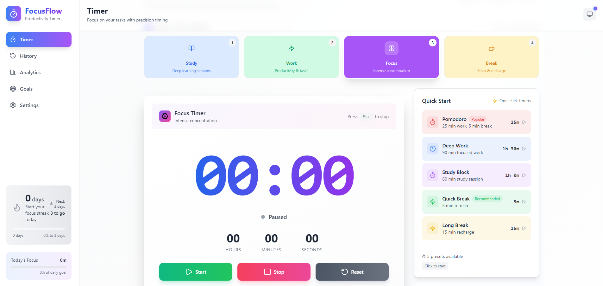

# ⌚ FocusFlow - React Progressive Web App

 


## 🌟 Project Description
Boost productivity with ChronoLogic, an intelligent timer supporting Pomodoro, custom intervals, and auto-breaks. Track goals, streaks, and progress with visual analytics and AI-powered insights. Enjoy offline PWA support with push notifications and full privacy. Perfect for maintaining focus and building consistent work habits

## 🚀 Live Demo
You can check out the live version of the project [here](https://timerapp-snowy.vercel.app/).


## ✨ Key Features

### 🎥 Media Discovery
- 🏠 Smart Timer
- 🔍 Streak System
- 📺 PWA Support

### 🛠 Interactive Features
- 💾 Analytics Dashboard with localStorage persistence
- 🌓 Light/Dark mode toggle
- 📱 Fully responsive design
- ⚡ Smooth animations with Framer Motion
- 🎡 Session History
- 📊 Progress Insights
- 🥅 Goal Tracking


### 🛡 Technical Features
- ⏳ Loading skeletons for better UX
- 📦 Lazy-loaded components
- 🏷 SEO optimization with React Helmet

## 🛠 Tech Stack

| Category        | Technology                          |
|-----------------|-------------------------------------|
| Frontend        | React.js (Vite)                     |
| State Management| Zustand                           |
| Styling         | Tailwind css                        |
| Routing         | React Router DOM                    |
| Animation       | Framer Motion                       |
| Icons           | React Icons                         |

## 📁 Project Structure
movie-explorer/
├── public/
│ └── (static assets)
├── src/
│ ├── assets/ 
│ ├── components/ 
│ │ ├── Analytics/
│ │ ├── ConfirmationModel/ 
│ │ ├── DailyGoals/ 
│ │ ├── ErrorBoundary/ 
│ │ ├── LoadingSpinner/ 
│ │ ├── QuickStart/ 
│ │ ├── RecentSessions/ 
│ │ ├── SessionList/ 
│ │ ├── StatsCard/ 
│ │ ├── StreakCount/ 
│ │ ├── ThemeToggle/ 
│ │ ├── Timer/ 
│ │ ├── TimerCounter/ 
│ │ ├── TimerDisplay/ 
│ │ └── TimerForm/
| | 
│ ├── contexts/ 
│ ├── hooks/ 
│ ├── pages/ 
│ │ ├── AnalyticsPage/ 
│ │ ├── GoalsPage/ 
│ │ ├── LandingPAge/ 
│ │ ├── HistoryPage/ 
│ │ ├── SettingsPage/ 
│ │ ├── TimerPage/ 
│ │ 
│ ├── services/
│ ├── styles/ 
│ ├── utils/ 
│ ├── App.jsx 
│ └── main.jsx 
├── serviceWorkerRegistration 
├── package.json 
└── README.md 


## 🏁 Getting Started

### Prerequisites
- Node.js (v14+)
- npm (v6+) or yarn


### Installation
1. Clone the repository:
   ```bash
   git clone https://github.com/prabhanjansp/timerapp
   cd movie-explorer
Install dependencies:

bash
npm install
# or
yarn install


Run the development server:

bash
npm run dev
# or
yarn dev
🧪 Testing
Run tests with:

bash
npm test
# or
yarn test
🚀 Deployment
Build for production:

bash
npm run build
# or
yarn build
Deploy the dist folder to your preferred hosting service.

📝 License
This project is licensed under the MIT License - see the LICENSE.md file for details.

🙏 Acknowledgments

Tailwind for awesome React components

Vite team for the blazing fast build tool

📬 Contact
For questions or feedback, please contact Prabhanjan at puranikchetan97@gmail.com

Made with ❤️ by Prabhanjan